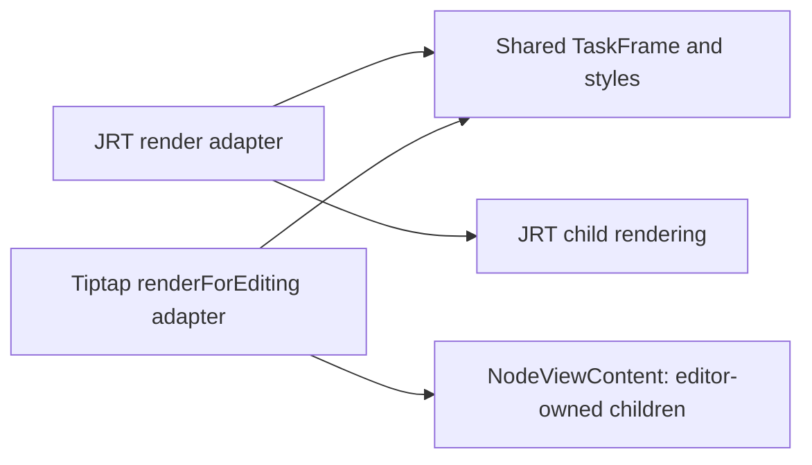

# Ritual source and shared rendering research — 2 October 2026

## Scope and status

The operator authorized research before choosing the next source syntax, and
wants block reading/editing code co-located without duplicated formatting.
Semantic JSON and Tiptap remain the current architecture. No application codec,
reader, editor UI, saved document, database or dependency was changed here.
These findings are a decision aid, not an accepted source-format rollout.

Follow-up: the operator subsequently chose 16-character alphanumeric Nano IDs.
See [the implemented identity policy and retained-source assessment](041-ritual-node-identities.md).
The measurements below retain their original full-UUID baseline.

Code and public synthetic samples live in
[`editor-trial/source-formats`](../editor-trial/source-formats/README.md).
The five unchanged rituals from the operator's approved private Mongo backup
were read locally; hashes and exact JRT reconstruction were checked. Sources,
names and identifiers were not printed or copied into research artifacts.

## What was tested

Each trial prints and parses the same semantic tree with the same full UUIDs.
Comparison requires exact equality, a stable second print, preserved attributes,
opaque legacy payloads, and distinctions between missing children, empty
children and adjacent text nodes. An edited speech line must retain every
structural identity. Synthetic checks cover all supported tags, whitespace,
quotes, Hebrew, interpolation-looking literals, nested attributes and refusal
of Pug expressions/template programs. Twenty-seven round-trip/privacy/grammar
checks and six installed-Markdown characterization checks pass.

| Projection | Exact corpus round trips | UTF-8 bytes | Physical lines |
| --- | --- | ---: | ---: |
| Current Ritual Text | 5/5 | 298,115 | 5,422 |
| Bounded semantic Pug trial | 5/5 | 363,359 | 1,531 |
| Compact Ritual Text trial | 5/5 | 289,713 | 5,302 |
| Explicit directive-tree trial | 5/5 | 325,346 | 7,481 |

The original Pug sources total 183,349 bytes, but lack stable IDs and are not an
equivalent canonical serialization. The Pug trial has ~72% fewer lines than the
current projection, but ~22% more bytes. Its mixed inline syntax compacts whole
sentences onto one line; those lines can be long. The compact trial saves ~2.8%
in this corpus. The directive trial grows ~9% in bytes and ~38% in lines.

The public synthetic sample includes titles, variables, notes, speech/actions,
mixed inline formatting, lists, an image and opaque content. Its projections
are 22/13/18/36 lines and 1,091/1,221/1,048/1,300 bytes respectively. The private
corpus is five existing rituals, not a user study or a broad language corpus.
No parser timing or mobile performance conclusion is claimed. Malformed private
input and codec failures are reported without exception excerpts; a synthetic
subprocess regression covers damaged corpus and row JSON.

## Source-format findings

### Bounded semantic Pug

**Observed:** Pug can express the owned semantic document exactly, including
stable IDs and inline elements. Magickli currently lexes/parses Pug rather than
executing templates (`src/doc/prepare.js`). The trial decodes attributes with
`JSON.parse`; unsupported AST programs are rejected, never evaluated.

**Strength:** familiar indentation, named properties, and `#[...]` mixed inline
content. It handles the actual nesting well. Using Pug as a text projection
would not undo Tiptap, JSON persistence, CAS saves or the current reader.

**Cost:** it needs a new strict semantic adapter and reverse printer; the legacy
compiler is not that adapter. Exact text needs special handling: Pug inserts
newlines between pipe lines and empty Text nodes at interpolation boundaries.
The trial uses reserved literal wrappers where necessary. Full IDs and those
fallbacks mean fewer lines need not mean fewer bytes. Readable source with folded
metadata is more promising than treating raw size as the deciding factor.

This is not unrestricted Pug. Executable attributes, includes, mixins, loops and
other template programs would need explicit refusal in a production contract.
Comments/whitespace and shortcut spelling would not survive canonical visual
regeneration unless a separate source-preservation layer were implemented.

### Terser Ritual Text

**Observed:** common speech/actions, titles and one-text blocks can be simpler
without changing the app's tree parser. The trial emits `hiero~UUID: Welcome.`,
`* keryx~UUID Open the door.`, `title~UUID Opening`, and
`note~UUID | Prepare the space.`. Exact JSON/literal fallbacks remain.

**Strength:** the shortest implementation path; owned grammar and exact
validation already exist. We can preserve IRC-style shortcuts without forcing
Markdown or HTML meanings onto ritual commands.

**Cost:** punctuation edits alone barely reduce this corpus. Mixed inline
content still spreads across lines; a compact inline form is a larger grammar
choice. JSON attributes and opaque payloads remain verbose. The trial does not
establish that users find it easier than Pug.

### Markdown and directives

**Observed:** the exact directive-tree trial round-trips, but adds explicit
closing lines and does not provide a brevity improvement.

**Observed in the installed `react-markdown`/`remark-gfm` parser:** speech is an
ordinary paragraph, `* Doer action` is a bullet list, `:::` is ordinary text,
HTML-like summaries are raw HTML nodes, and proposed ID suffixes/variable tokens
remain literal text. Native emphasis and images work, but carry no stable
semantic IDs. Six synthetic characterization checks establish those behaviours.

**Not tested:** a full CommonMark+extensions codec with paragraph/emphasis/image
shorthands. The measured numbers are not a verdict on every possible Markdown
design.

**Design assessment:** ordinary Markdown may suit prose-heavy documents, but
ritual roles, variables, audience semantics, stable inline IDs, opaque nodes and
exact text require a substantial extension contract. `* Doer action` collides
with Markdown bullet notation unless the pre-converter gives it an explicit
precedence rule. Native raw HTML/custom tags would add another surface, which
also conflicts with the operator's preference to avoid overloading Markdown/HTML.

A Markdown-oriented option stays technically possible. Its next useful test
would use a real parser, define paragraphs/inline identity and exact fallback
rules, and compare the same public sample before investing in full corpus work.
It is not currently the strongest fit for this structured ritual workload.

### Identity presentation affects all options

Full UUIDs are the largest visible nuisance shared by all candidates. Folding
or otherwise de-emphasizing metadata in the source editor preserves copy/export
and semantic identity without changing the document. Hiding metadata in the UI
is a separate editor feature; it has not been implemented.

Omitting IDs entirely is not a free equivalent: after source reordering,
duplicating similar tasks or concurrent edits, identifying which semantic node
survived becomes ambiguous. An incremental source map/reconciliation approach
could work, but requires a policy and tests. Do not silently recreate every ID
when changing source modes. Opaque payloads also benefit from folded presentation.

## Recommendation for the joint decision

1. Keep semantic JSON as saved authority and Tiptap as editing engine.
2. Shortlist **bounded Pug** and **a compact ritual-specific syntax**. Judge the
   public samples with metadata both visible and conceptually folded, focusing
   on mixed inline sentences and everyday property editing.
3. Pug currently has the strongest demonstrated readability advantage for mixed
   tree content; compact Ritual Text has the simplest implementation path. Raw
   byte size does not decide between them. A new compact inline grammar could
   change the comparison and has not been evaluated.
4. Keep Markdown as a prose-oriented alternative rather than adopting the tested
   verbose directives. If it remains preferred after viewing samples, do the
   real CommonMark extension spike before choosing it.

No recommendation here is a final operator decision. Source projection changes
would need draft dialect/version handling, preservation of dirty source buffers,
mode-switching rules, error messages, guide updates and editing/mobile checks.
They do not require a SQL migration while saved semantic JSON is unchanged.
Historical legacy Pug editing and immutable pending SQL requests stay separate.

## Shared reader/editing architecture

### Current code

- `src/doc/blocks.jsx` owns JRT classes with `render()`. Styling, role headers,
  reader context, DOM references and footnote collection are mixed together.
- `src/app/doc/[_id]/DocRender.tsx` owns reader variables, role presentation and
  navigation. `blocks.jsx` currently imports aliases back from that reader.
- `src/doc/tiptapRitual.ts` defines editable structural nodes and clipboard
  `renderHTML`/`parseHTML`; it renders labels/boxes, not the reader's role cards.
- `SemanticEditor.module.css` independently styles the current editing boxes.

The operator's paired `render()` / `renderForEditing()` idea remains appropriate.
Pair the adapters around **one shared visual component and stylesheet**. They
cannot use the same child renderer: JRT renders reader children, while Tiptap
must own editable child DOM, selection, transactions and composition.

### Suggested co-location

```text
src/doc/ritualBlocks/task/
  TaskFrame.tsx             shared card, role header, typography and body slots
  task.module.css           shared formatting, plus explicit edit affordances
  render.tsx                JRT reader adapter and reader-specific effects
  renderForEditing.tsx      Tiptap node view and editing-specific controls
```

The method names can also live on their respective adapter definitions. Separate
files are recommended so a reader import cannot accidentally pull Tiptap into
its dependency graph. Avoid a barrel that re-exports the editor into the reader.
Shared role presentation should be moved to a neutral module, avoiding the
current reader-to-block-to-reader dependency cycle.



Conceptually:

```tsx
// Reader adapter
<TaskFrame roleHeader={readerRoleHeader} audienceState={readerAudienceState}>
  {renderReaderChildren()}
</TaskFrame>

// Editing adapter: stable wrapper/content tags; metadata controls are noneditable.
<NodeViewWrapper>
  <TaskFrame roleHeader={authorRoleHeader} editing>
    <NodeViewContent />
  </TaskFrame>
</NodeViewWrapper>
```

This is a design sketch, not implemented code. The shared frame receives resolved
presentation inputs; it does not own authentication, node mutation, footnote
registries, navigation, variable resolution or editor transactions. Formatting
changes land in one place and appear in both modes. Reader/edit-specific
behaviour remains explicit and co-located.

`renderHTML` is still needed for clipboard serialization. A Tiptap NodeView is
not exported HTML. Existing `data-ritual-meta`, schema identity, task isolation,
paste remapping and link/image safety must remain intact. UI controls must not
enter clipboard or saved semantic content. Add client node views separately from
schema/semantic modules used by server code and corpus checks.

### Suggested implementation order, pending the operator's decision

1. Extract shared presentation for task cards, role headers, notes and titles;
   preserve existing reader behaviour and child-render order.
2. Adapt those editor nodes to shared frames; show editing tools on selection
   without relocating/remounting the editable content slot. Reader colours,
   quotes, action italics and spacing become the default appearance.
3. Extend to summaries, images and grade/variable tokens. Summaries stay
   discoverable while authoring; actual collapsed reading remains in preview.
   Authors edit a variable token, while a reader sees its resolved value.
4. Treat footnotes as a separate follow-up. The reader currently collects them
   by mutating JRT instances during rendering and displays them outside the task
   body; editor child DOM cannot simply be moved to imitate that arrangement.
5. Keep the existing real reader preview for exact variable values, role-based
   highlighting, navigation and unusual legacy blocks.

Verification should protect both contracts: reader appearance/behaviour and
editor cursor boundaries, undo, paste, source equality, IME, account concealment,
private image access and small-screen usability. Test that the reader dependency
graph remains editor-free. Do not change the document schema solely to achieve a
visual layout. These stages remain a proposal for our joint decision.

## Sources

- [Pug plain text](https://pugjs.org/language/plain-text.html): inline/piped text
  and whitespace rules; actual installed AST behaviour was also tested.
- [Tiptap React NodeViews](https://tiptap.dev/docs/editor/extensions/custom-extensions/node-views/react):
  `ReactNodeViewRenderer`, `NodeViewContent`, noneditable metadata and stable
  content tags.
- [Tiptap NodeViews](https://tiptap.dev/docs/editor/extensions/custom-extensions/node-views):
  editor rendering differs from serialized HTML.
- [CommonMark 0.31.2](https://spec.commonmark.org/0.31.2/): paragraphs, list
  syntax, inline parsing and raw HTML are part of the language contract.

These are primary references, consulted on 2 October 2026. Size/round-trip
findings above come from local code and corpus measurements, not these pages.
